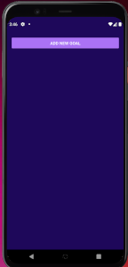
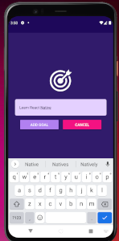
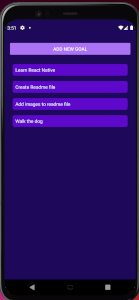

    <h3 align="center">Goal Mobile App</h3>

## License

## Description

This is a Goal tracking app created for Android and IOS mobile devices built as a project for a React Native course. The app
allows users to add and delete goals on mobile devices. There is currently no option to save goals so they persist on reload, but as I learn more React Native, I may add that functionality.

## Table of Contents

- [License](#license)
- [Description](#description)
- [Table of Contents](#table-of-contents)
- [Installation Instructions](#installation-instructions)
- [Usage](#usage)
- [Contributors](#contributors)
- [Testing](#testing)
- [Questions](#questions)

  
(<a href="#top">back to top</a>)

## Installation Instructions

  <ul>
    <li>Clone this repo by entering the folling command from the command prompt: <code>https://github.com/judo2000/react-native_goals.git</code></li><li>Change into the new director: <code>cd react-native_goals</code></li>
    <li>From the command prompt, enter: <code>npm i</code> to install all necessary packages</li>
  </ul>
  
  
(<a href="#top">back to top</a>)

  
  ## Usage

This app is not deployed as it is a mobile app. To view it you will need to install the Expo Go app to your device or download the Android Studio app to your computer to view it on an Android simulator. From the terminal screen in your IDE, run <code>npm start</code>. From there you will see a QR Code that you can scan from your mobile device or if you are using the Android simulator you can just press <code>a</code> from the terminal after running <code>npm start</code>.

Once running you can click the 'Add New Goal' button and a modal will slide up. Enter your goal and click 'Add Goal'. The modal will slide out and the new goal will appear on the home screen. To delete a goal, simply tap it and it will be deleted.

  
(<a href="#top">back to top</a>)

  
    
  ## Contributors
  NA

  
(<a href="#top">back to top</a>)

## Testing

NA

  
(<a href="#top">back to top</a>)

## Questions

<a class="hoverable" href="https://linktr.ee/stephensmoore" target="_blank">Stephen Moore</a>

  
(<a href="#top">back to top</a>)

